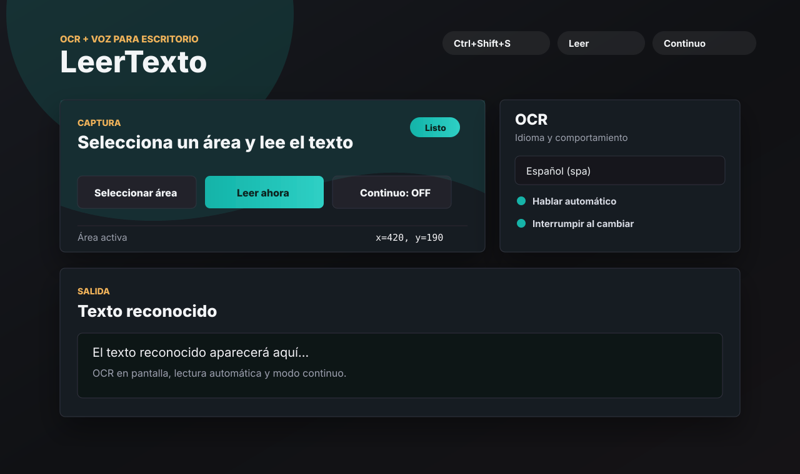
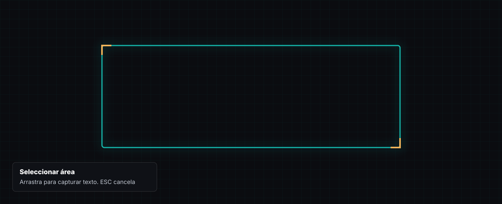

# VisionSpeak

VisionSpeak es una app de escritorio para Windows que permite seleccionar un area de la pantalla, aplicar OCR y leer el texto en voz alta. Esta pensada para juegos, novelas visuales, capturas o cualquier pantalla donde el texto no se puede copiar.



## Caracteristicas

- Seleccion de area con una superposicion limpia y precisa.
- OCR con Tesseract.js para espanol, ingles y japones.
- Lectura por voz usando las voces instaladas en Windows/Chromium.
- Modo continuo para detectar cambios de texto automaticamente.
- Ajustes de velocidad, volumen, intervalo y confirmacion de lectura.
- Atajos globales para usar la app sin cambiar de ventana.

## Atajos

| Accion | Atajo |
| --- | --- |
| Seleccionar area | `Ctrl+Shift+S` |
| Leer ahora | `Ctrl+Shift+L` |
| Activar/desactivar modo continuo | `Ctrl+Shift+C` |
| Cancelar seleccion | `ESC` |

## Vista de seleccion



## Instalacion

Requisitos:

- Windows 10/11
- Node.js 18 o superior
- npm

```bash
npm install
npm start
```

El primer OCR puede tardar mas porque Tesseract descarga los datos del idioma seleccionado.

## Uso recomendado

1. Ejecuta la app con `npm start`.
2. Presiona `Ctrl+Shift+S` o usa el boton `Seleccionar area`.
3. Arrastra sobre la zona exacta donde aparece el texto.
4. Presiona `Ctrl+Shift+L` para reconocer y leer.
5. Activa `Continuo` si el texto cambia con frecuencia.

## Voces en Windows

Las voces disponibles dependen de Windows y Chromium. Para agregar mas:

1. Abre `Configuracion`.
2. Ve a `Hora e idioma` > `Voz`.
3. En `Administrar voces`, instala las voces que quieras usar.
4. Reinicia LeerTexto o pulsa `Actualizar`.

LeerTexto muestra presets populares de voces en espanol solo cuando esas voces existen en el sistema.

## Notas

- Si el OCR no reconoce bien, ajusta el rectangulo para capturar solo el panel de texto.
- Cambia el idioma OCR si el contenido esta en ingles o japones.
- Algunos juegos con anti-cheat pueden bloquear capturas de pantalla; la app no intenta evadir esas protecciones.

## Stack

- Electron
- Tesseract.js
- screenshot-desktop
- Web Speech API
